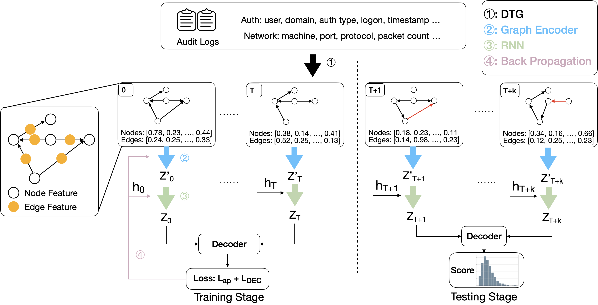
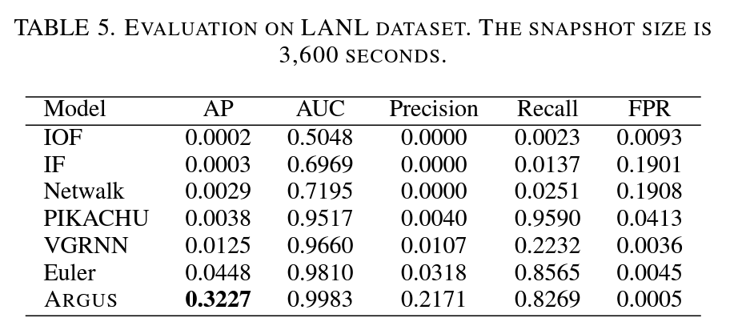
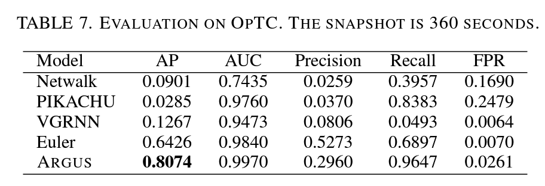

# Argus
This is the repo for the paper "Understanding and Bridging the Gap Between Unsupervised Network Representation Learning and Security Analytics" which is accepted in IEEE Security & Privacy 2024.
There is a [blog](https://c0ldstudy.github.io/posts/GSA/) summarizing the main idea of the paper or you can check the [paper](https://www.computer.org/csdl/proceedings-article/sp/2024/313000a012/1RjE9Q5gQrm) directly.

## Setup

#### Python Environment
Deploy a python environment and download related python packages:
```bash
# Generate a virtual python environment
conda create -n argus python==3.9
# Activate the python environment
conda activate argus
# Install pytorch, pytorch-geometric, and related packages
pip install torch==1.10.1+cu111 torchvision==0.11.2+cu111 -f https://download.pytorch.org/whl/cu111/torch_stable.html
pip install -r requirements.txt
pip install torch_scatter torch_sparse torch_cluster torch_spline_conv -f https://data.pyg.org/whl/torch-1.10.1+cu111.html --no-index
```
#### Dataset
For [LANL Dataset](https://csr.lanl.gov/data/cyber1/), we use `auth.txt.gz`, `redteam.txt.gz` and `flows.txt.gz`.

For [OpTC Dataset](https://github.com/FiveDirections/OpTC-data), we use the "START" events related to the "FLOW" objects (i.e., network flows), and the statistics after filtering following the [paper](https://ieeexplore.ieee.org/abstract/document/9789921). The dataset is available in the [link](https://drive.google.com/drive/folders/1pTU-ZcyJbzoB1FuvujXe-ynaUy8O-PVD?usp=sharing). 

The datasets need to be preprocessed by the files `./loaders/split_lanl.py` and `split_optc.py` after setting the dataset paths at the beginning of each file.

```bash
# revise the Line 6-9 of ./loaders/split_lanl.py to store preprocessed LANL dataset
RED = '' # Location of redteam.txt
SRC = '' # Location of auth.txt
DST = '' # Directory to save output files to
SRC_DIR = '' # Directory of flows.txt, auth.txt

cd loaders
python split_lanl.py

# revise the Line 20 in ./loaders/loal_lanl.py to add the DST path in ./loaders/split_lanl.py
LANL_FOLDER = ''


# revise the Line 7-9 of ./loaders/split_optc.py to store preprocessed OpTC dataset
RED = '' # Location of redteam.txt
SRC = '' # Location of auth.txt
DST = '' # Directory to save output files to

cd loaders
python split_optc.py

# revise the Line 19 in ./loaders/loal_optc.py to add the DST path in ./loaders/split_optc.py
OPTC_FOLDER = ''

```

## System Structure



## Experiments

`python main.py --dataset LANL --delta 1 --lr 0.01`


`python main.py --dataset OPTC --delta 0.1 --lr 0.005 --patience 10`



Thanks for the supporting from [Euler](https://github.com/iHeartGraph/Euler) and [LibAUC](https://github.com/Optimization-AI/LibAUC).


### Citation
```bibtex
@inproceedings{xu2023understanding,
  title={Understanding and Bridging the Gap Between Unsupervised Network Representation Learning and Security Analytics},
  author={Xu, Jiacen and Shu, Xiaokui and Li, Zhou},
  booktitle={2024 IEEE Symposium on Security and Privacy (SP)},
  pages={12--12},
  year={2023},
  organization={IEEE Computer Society}
}
```
